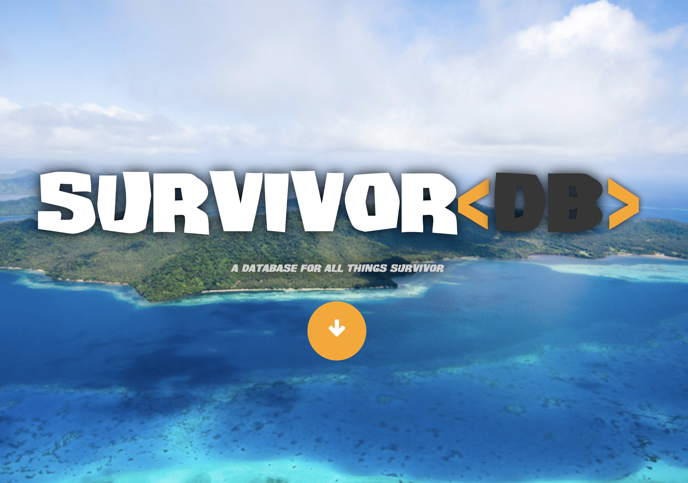
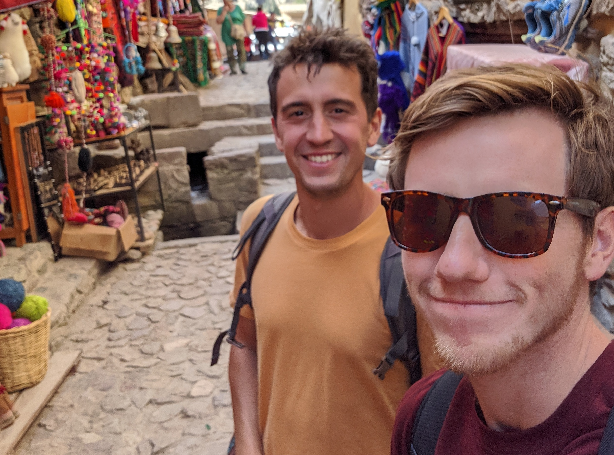
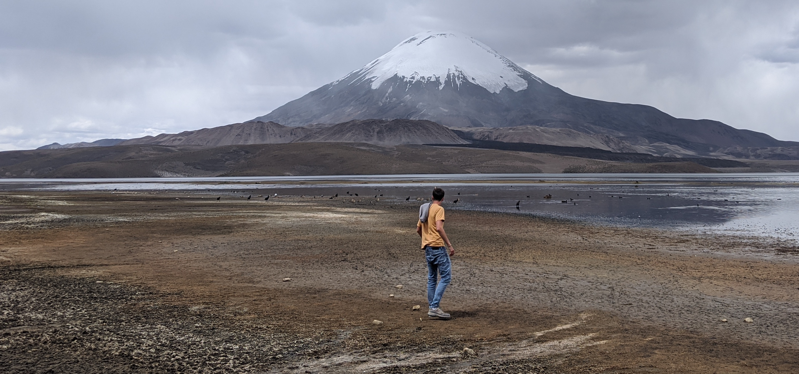
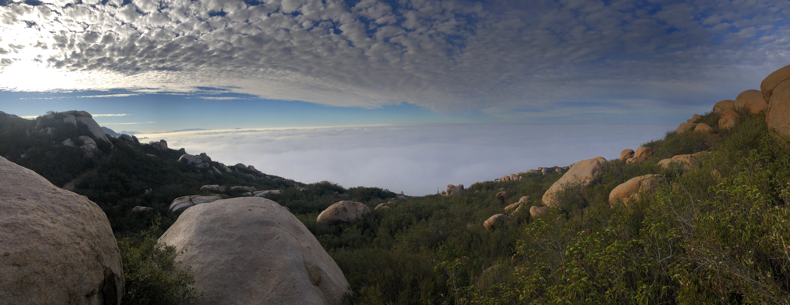

# Peru

Before Covid-19 hit I wasn't in a good place mentally. I had just returned home after 3 months traveling in South America. I originally planned to go for much longer; but the truth is that I struggled out there and made a difficult decision to come home. I wasn't lonely persay, but I felt that had lost sight of my purpose out there. My plan was to go to Peru and study Spanish until I felt more comfortable with the language, then travel wherever the wind took me. Along the way I made a friend who ironically enough, was also named Victor. He is Barcelona native, finance guru, and world traveler. We lived together along with some other expats in a homestay run by 4 Peruvian siblings. I spent my days in classes striking up every conversation I could to use my Spanish, soaking up the full experience of being abroad with zero obligations to home or work. It was incredible. When I wasn't in class I was talking to strangers in the street, or to friends in the local restaurants or markets. During the night we would go to the bars and dance to regaetton with other classmates and friends; even with the teachers from our school.

# Transitions

Around a month and a half after arriving in Cusco, Victor and I started to discuss the idea of traveling through South America together. By this time we had become pretty good friends. We were hanging out every day along with our other friend, Dean, an english major from Ohio. We were a pretty tight trio out there, with some kind of reputation among our friend group. In any case, I was wrapping up my studies and feeling more confident than ever with my Spanish. Travelers had been trickling in and out of Cusco during my stay, 'old' friends moving on to the next place with new ones filling the empty spaces left behind. 2 months had passed; and the time felt right to move on. Victor was planning a long multi-month sebatical through Chile, Argentina, and Brazil. He had already visited many of the countries that I was interested in seeing, Ecuador and Colombia. I had come out here hoping to be challenged, to be put to the test, to make mistakes and learn what traveling meant to me. But also to take advantage of this rare moment in my life where I could be totally free. I had no family nearby, no friends, no job to worry about. Yet, all of the sudden this perfect plan was sitting right in front of my face and I didn't even have to do anything. Victor would be my guide, hell, he was a native Spanish speaker, he could lead the way.

# Chile

This is where my trip all fell apart. By agreeing to join someone else's dream trip through South America, I had broken an agreement to myself that I would fully be in charge my own destiny out there. Instead, I made myself beholden to someone else in exchange for comfort. I was no longer autonomous, I wasn't as curious, and I wasn't taking nearly as many risks. Worst of all I wasn't practicing my spanish in the same organic way that I was with random people throughout Cusco. To Victor's credit, he was very conscious and accomodating to my goals out there. We had many discussions about what I wanted, what I felt I was lacking out there, and we tried desperately to make being travel companions work. We spent 4 weeks together through the Northern half of Chile.

I planned to spend the holiday in Peru with my friend, Alejandro, and his family. I hoped that while I was there that I would come up with a remedy to the dissonance that was currently plaguing my time in South America. I respected Victor so much, I struggled to admit to him that I couldn't travel with him any more. One day over Christmas break, I received a phone call from my college classmate telling me his startup had just raised enough money to employ a small tiger team of engineers that would scale the company. This was my out. I wouldn't have to hurt Victor's feelings if I used this as my excuse. It's probably worth mentioning at this time that I was also experiencing anxiety over my unemployment and perception of my career becoming stagnant. It was enough to make me jump ship. Hurredly, I accepted the job offer. I returned to Chile and traveled with Victor for another week. I told him I'd be leaving for a new job opportunity. He was dissapointed. Almost heart broken. Something was wrong and he knew it. He cried the day I left and I couldn't understand why he would respond that way. By that time we had been fighting along our travels. I felt happy to get out of there. I felt like I was escaping something. Somehow, I was able to convince myself that I'd be happier in an office in downtown San Francisco over a laptop, than being completely free in South America to experience every beauty it has to offer. The fight or flight response is powerful thing I guess.

# San Franscisco

The grass is always greener. I was in shock to be back in America. I was in shock to be back at work. I was in shock to be at a 5 person startup and to have responsibilities again. I was heavily anxious after have spent a month in Chile feeling confused and powerless in a friendship that ultimately went against my personal interests. I felt like I had wasted something good. I felt I had made a mistake but the only thing to do was ignore it. I felt that I had let down my friends and family; who had once been inspired by my decision to leave for South America. I had failed them. I had failed myself and I had failed South America.

I was in no mental state to work. I wasn't there. I hated myself for what I had done; it didn't make any sense. San Francisco was an entirely new city and I had few friends and connections. I began to hear word about this new virus that was spreading from China. It started to sound serious. Companies started calling their employees to work from home and within 2 months of being in San Francisco the pandemic had begun.

# Home

By mid March 2020 I was like so many others, back with my parents. In San Diego. What had happened? I hadn't even been gone that long, but everything felt so so different. I had said goodbye to all my friends, off to South America I had told them. Now I was back, and yet I couldn't even see them. Did they still even like me? Or was I just a failure to them? They all were living in places close to each other. I was stuck with my parents. My anxiety was at an all time high.

My brother told me about this show Survivor; that I should start watching it. Wasn't that show like 50 years old? I started binging it, every season. Every day I would wake up and stay in bed watching the show, barely working, barely doing anything. It became the thing that took the pain away. Because of it, I didn't have to recognize or reconcile the shit hole that I was now in. Granted, no one predicted Covid, but the totality of all problems going on in my life had brought me to one of my lowest points of all time.

# Reflections

I wrote this blog in one hour, one night in August 2022. I don't really want it to be edited, cleaned up, or anything nearly resembly perfect. Its more or less stream of consciousness. It was originally intended to be about the Survivor Database, but as I started the lead up to it, things exploded into what I was really wanting to write about. It doesn't end happily, and I do still struggle to forgive myself for the decision I made. I have a hard time accepting that I couldn't be brave enough to stick it out, and face my fears, and find better solutions to my problems. I discovered that I may run in the face of danger. That I'm not as resilient and strong as I want to be. But I must give myself credit for the things I did accomplish too. While in the end I did run, I also spent 3 months facing other fears head on. I put myself out there in ways I never imagined I would. I made some amazing life long relationships. I developed an even deeper passion for Spanish and became just a little bit closer to the person I dream to one day be.
